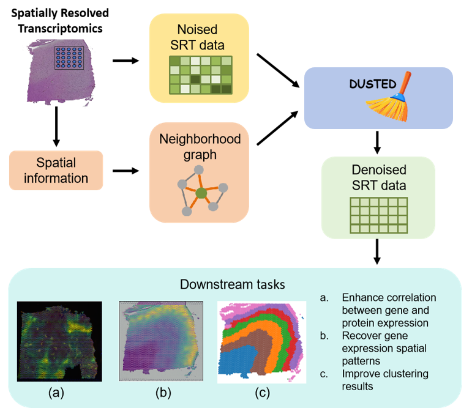
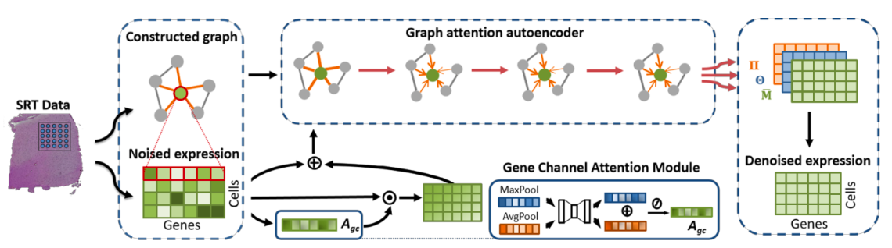

# DUSTED: Dual-attention Enhanced Spatial Transcriptomics Denoiser

## Introduction

<div align="center">
  
  <figcaption>Fig.1 Overview of DUSTED denoising procedure.</figcaption>
</div>


Spatial transcriptomics is a powerful technique for profiling gene expression in tissue sections while retaining spatial context. However, the data can be noisy, requiring robust methods for denoising. **DUSTED (Dual-attention Enhanced Spatial Transcriptomics Denoiser)** introduces a sophisticated denoising approach that leverages both gene expression matrices and neighborhood graphs constructed using spatial information.

<div align="center">
  
  <figcaption>Fig.2 The framework of DUSTED.</figcaption>
</div>

DUSTED enhances the estimation of clean gene expression levels by incorporating spatial information, improving performance in tasks like gene expression analysis and spatial pattern identification. Using a **dual-attention mechanism**, DUSTED focuses on both spatial features and noise variations, interpolating gene expression at any location based on neighboring spots. Additionally, it refines SRT counts to better align with biologically realistic distributions. By leveraging prior biological knowledge, DUSTED accurately fits true gene expression profiles, achieving superior self-supervised SRT data denoising without external auxiliary information.

# Update on Evaluation Metrics

We have updated our evaluation methodology for dimensionality reduction and clustering. Initially, we used STAGATE for dimensionality reduction followed by the **mclust** clustering method. However, after further consideration, we realized that PCA (Principal Component Analysis) is a more suitable choice for dimensionality reduction. Therefore, we have updated the corresponding evaluation results using **PCA for dimensionality reduction** followed by **mclust** clustering. The updated ARI, NMI, and HS results are as follows:

### ARI (Adjusted Rand Index) Results

| Dataset   | Raw   | STAGATE | DCA   | MAGIC | Smoother | DUSTED | stLearn | Sprod |
|-----------|-------|---------|-------|-------|----------|--------|---------|-------|
| 157616    | 0.38  | 0.32    | 0.38  | 0.34  | 0.5      | 0.56   | 0.59    | 0.23  |
| 157675    | 0.41  | 0.42    | 0.45  | 0.41  | 0.53     | 0.55   | 0.44    | 0.29  |
| 151674    | 0.46  | 0.37    | 0.30  | 0.32  | 0.39     | 0.61   | 0.4     | 0.24  |
| 151673    | 0.60  | 0.53    | 0.47  | 0.44  | 0.6      | 0.6    | 0.61    | 0.38  |
| 151672    | 0.54  | 0.56    | 0.35  | 0.55  | 0.49     | 0.49   | 0.48    | 0.44  |
| 151671    | 0.57  | 0.57    | 0.34  | 0.56  | 0.58     | 0.59   | 0.45    | 0.43  |
| 151670    | 0.45  | 0.41    | 0.19  | 0.5   | 0.43     | 0.46   | 0.27    | 0.28  |
| 151669    | 0.24  | 0.27    | 0.05  | 0.36  | 0.43     | 0.3    | 0.35    | 0.26  |
| 151510    | 0.48  | 0.39    | 0.37  | 0.38  | 0.46     | 0.5    | 0.46    | 0.36  |
| 151509    | 0.39  | 0.39    | 0.33  | 0.42  | 0.31     | 0.49   | 0.49    | 0.29  |
| 151508    | 0.51  | 0.42    | 0.34  | 0.35  | 0.54     | 0.45   | 0.49    | 0.4   |
| 151507    | 0.50  | 0.56    | 0.53  | 0.43  | 0.54     | 0.55   | 0.52    | 0.26  |
| **Mean**  | **0.46 ± 0.10** | **0.43 ± 0.10** | **0.34 ± 0.13** | **0.42 ± 0.08** | **0.48 ± 0.08** | **0.51 ± 0.09** | **0.46 ± 0.09** | **0.32 ± 0.08** |

### NMI (Normalized Mutual Information) Results

| Dataset   | Raw   | STAGATE | DCA   | MAGIC | Smoother | DUSTED | stLearn | Sprod |
|-----------|-------|---------|-------|-------|----------|--------|---------|-------|
| 157616    | 0.56  | 0.51    | 0.56  | 0.51  | 0.6      | 0.68   | 0.69    | 0.39  |
| 157616    | 0.56  | 0.57    | 0.60  | 0.53  | 0.64     | 0.7    | 0.57    | 0.49  |
| 151674    | 0.62  | 0.50    | 0.46  | 0.52  | 0.49     | 0.74   | 0.50    | 0.38  |
| 151673    | 0.71  | 0.7     | 0.62  | 0.60  | 0.72     | 0.72   | 0.73    | 0.54  |
| 151672    | 0.66  | 0.67    | 0.49  | 0.67  | 0.65     | 0.65   | 0.64    | 0.58  |
| 151671    | 0.68  | 0.68    | 0.60  | 0.65  | 0.68     | 0.7    | 0.64    | 0.56  |
| 151670    | 0.57  | 0.52    | 0.32  | 0.55  | 0.55     | 0.55   | 0.51    | 0.45  |
| 151669    | 0.48  | 0.48    | 0.23  | 0.55  | 0.56     | 0.50   | 0.58    | 0.46  |
| 151510    | 0.60  | 0.56    | 0.48  | 0.56  | 0.59     | 0.66   | 0.63    | 0.47  |
| 151509    | 0.59  | 0.55    | 0.41  | 0.60  | 0.55     | 0.64   | 0.67    | 0.40  |
| 151508    | 0.64  | 0.60    | 0.45  | 0.51  | 0.67     | 0.63   | 0.65    | 0.51  |
| 151507    | 0.68  | 0.70    | 0.64  | 0.57  | 0.67     | 0.68   | 0.69    | 0.44  |
| **Mean**  | **0.61 ± 0.07** | **0.59 ± 0.08** | **0.49 ± 0.13** | **0.57 ± 0.05** | **0.61 ± 0.07** | **0.65 ± 0.07** | **0.63 ± 0.07** | **0.47 ± 0.07** |

### HS (Homogeneity Score) Results

| Dataset   | Raw   | STAGATE | DCA   | MAGIC | Smoother | DUSTED | stLearn | Sprod |
|-----------|-------|---------|-------|-------|----------|--------|---------|-------|
| 151676    | 0.56  | 0.51    | 0.58  | 0.51  | 0.6      | 0.68   | 0.69    | 0.4   |
| 151675    | 0.55  | 0.58    | 0.60  | 0.53  | 0.64     | 0.69   | 0.56    | 0.5   |
| 151674    | 0.61  | 0.50    | 0.47  | 0.52  | 0.48     | 0.73   | 0.49    | 0.39  |
| 151673    | 0.52  | 0.32    | 0.46  | 0.59  | 0.7      | 0.7    | 0.71    | 0.54  |
| 151672    | 0.6   | 0.61    | 0.46  | 0.61  | 0.58     | 0.59   | 0.58    | 0.52  |
| 151671    | 0.54  | 0.65    | 0.61  | 0.62  | 0.65     | 0.66   | 0.56    | 0.5   |
| 151670    | 0.51  | 0.46    | 0.28  | 0.5   | 0.49     | 0.55   | 0.42    | 0.37  |
| 151669    | 0.44  | 0.44    | 0.23  | 0.53  | 0.51     | 0.46   | 0.49    | 0.38  |
| 151510    | 0.58  | 0.59    | 0.48  | 0.5   | 0.56     | 0.65   | 0.59    | 0.48  |
| 151509    | 0.57  | 0.51    | 0.40  | 0.61  | 0.54     | 0.61   | 0.66    | 0.39  |
| 151508    | 0.64  | 0.60    | 0.45  | 0.51  | 0.67     | 0.62   | 0.63    | 0.5   |
| 151507    | 0.69  | 0.69    | 0.67  | 0.59  | 0.69     | 0.69   | 0.7     | 0.45  |
| **Mean**  | **0.57 ± 0.07** | **0.54 ± 0.10** | **0.47 ± 0.13** | **0.55 ± 0.05** | **0.59 ± 0.08** | **0.64 ± 0.08** | **0.59 ± 0.09** | **0.45 ± 0.06** |

---

Feel free to modify the explanations and structure as necessary for your specific audience.

## Installation

### Prerequisites
- Python 3.7+
- PyTorch
- torch-geometric
- matplotlib
### Setup
1. Clone the repository:
   ```bash
   mkdir DUSTED
   git clone git@github.com:Lifeomics/DUSTED.git
   cd DUSTED
   ```
### Project Structure
 ```
 ├── model.py              # Contains the DUSTED model and other architectures
 ├── loss.py               # Contains the custom loss functions  
 ├── trainer.py            # Script for training the DUSTED model
 ├── README.md             # Project documentation
 └── requirements.txt      # Python dependencies
 ```
## Cite
```
Zhu, J., Li, Y., Tang, Z., & Chang, C. (2025). DUSTED: Dual-Attention Enhanced Spatial Transcriptomics Denoiser. Proceedings of the AAAI Conference on Artificial Intelligence, 39(1), 1219-1227. https://doi.org/10.1609/aaai.v39i1.32110
```
